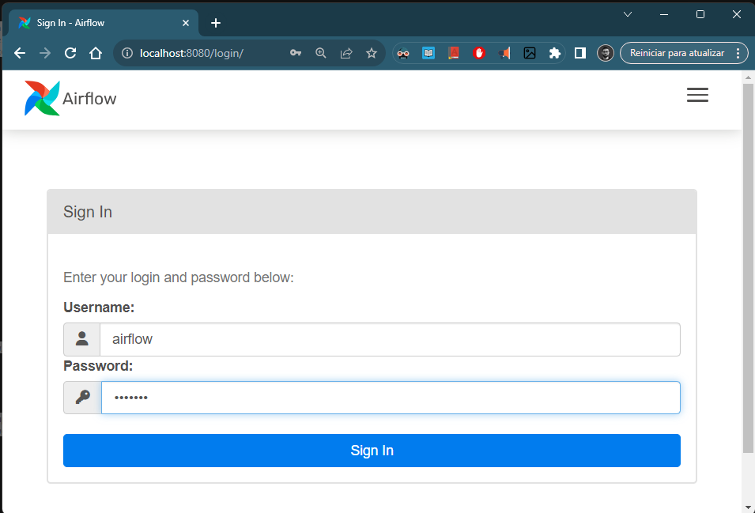

# Mission Log

Esse arquivo contém o registro das decisões importantes tomadas durante o desenvolvimento desse projeto.

TL;DR:

## Estrutura do Projeto

1. Decidi utilizar o docker compose sugerido na documentação do Airflow.
2. Adicionei ao docker compose mencionado acima uma imagem que contém spark, pyspark e jupyter notebook.

Essa stack é overkill para um exercício como esse, mas reflete melhor a estrutura que seria usada em produção.

---

## Configurações Iniciais (Docker + PySpark + Airflow)

1. Inicialização do projeto:
    - Fork do projeto no GitHub
    - Primeiro commit: desabilitei o versionamento dos arquivos csv no .gitignore
    - Baixei o docker-compose do Airflow [conforme a documentação](https://airflow.apache.org/docs/apache-airflow/stable/howto/docker-compose/index.html#fetching-docker-compose-yaml)

2. Testar as configurações default do docker-compose e checar funcionamento do PySpark dentro do container.
    - Para baixar a imagem e criar os containers: `docker compose up -d`

    - Aiflow funcionando OK. Para fazer login, usar as credenciais padrão (airflow/airflow)
    

    - Python instalado corretamente no container "airflow-worker":
        ```docker compose run airflow-worker airflow info```
    

3. Desabilitar versionamento de código dos logs gerados pelos containers.

4. Pyspark não está instalado no container, então decidi adicionar a imagem `jupyter/pyspark-notebook` ao docker compose. Dessa forma poderei testar a ETL interativamente pelo notebook enquanto desenvolvo.

---

## Respondendo às Perguntas do Desafio (no Jupyter Notebook)

1. Perguntas:
    - Qual a coluna com maior desvio padrão?
    - Qual valor mínimo e o máximo? (Estou considerando que esses valores são relativos à resposta da pergunta anterior)
    - Criação das colunas categóricas.
    - Renomear colunas categóricas.

2. Escrever o df final em formato parquet na pasta `output`.

---

## Orquestrar essa ETL usando Airflow

DAG:
1. Extração: leitura do arquivo de entrada.
2. Transformações:
    1. Criação das colunas categóricas
    2. Renomear colunas
3. Armazenamento: salvar o df final em parquet.